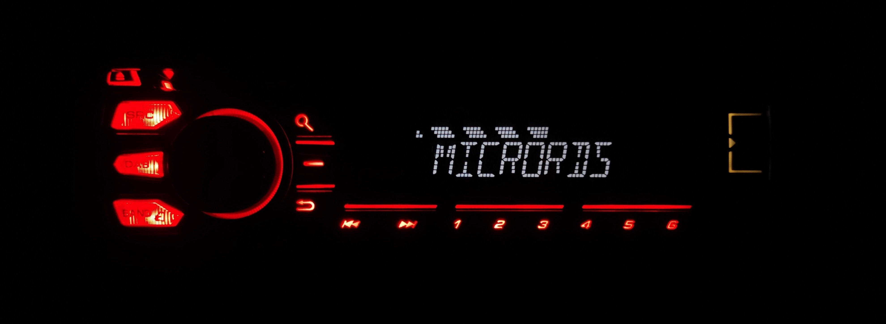

# MicroRDS

MicroRDS is a lightweight, software RDS encoder for Linux.



### Roadmap
- GPIO support (for RPi)
- UECP
- code optimalization

### Key Features:

- Lightweightness: Designed with efficiency in mind, the system boasts minimal resource requirements, ensuring optimal performance on a variety of hardware configurations.

- Extensive protocol support: Built-in compatibility for PS, PTY, PI, RT, RT+, CT, and PTYN.

- Seamless script usage: Flexibility of using familiar scripting languages like Bash, Python, and more, to effortlessly control RDS through FIFO.

## Installation

### Dependencies
on Debian-based distros, run `sudo apt install libao-dev libsamplerate0-dev` <br>
on Arch-based distros, run `sudo pacman -S libao libsamplerate` <br>
on Fedora, run `sudo dnf install libao-devel libsamplerate-devel` <br>

### Downloading the code

```
git clone https://github.com/barteqcz/MicroRDS.git
```

### Tweaking the features

If you prefer the program to utilize RBDS or disable the Stereo encoder, refer to the Makefile file for relevant instructions. RBDS is disabled by default, while Stereo is enabled by default.

### Compilation

Go to the `src` folder, and simply run `make`

## Usage

Once you compiled the program, use `./micrords` to run it. 

To see available FIFO commands list, see [FIFO command list](https://github.com/barteqcz/MicroRDS/blob/main/doc/fifo_command_list.md)

To see available program-built-in commands, run `./micrords --help`

## Credits

MicroRDS is a fork of [MiniRDS](https://github.com/Anthony96922/MiniRDS) written by [Anthony96922](https://github.com/Anthony96922)
